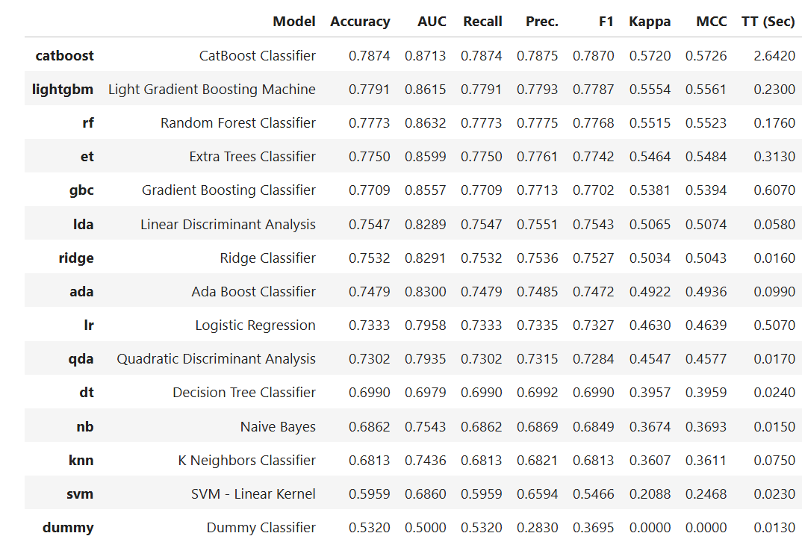
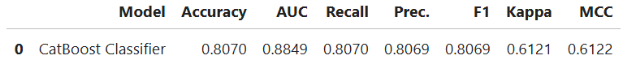
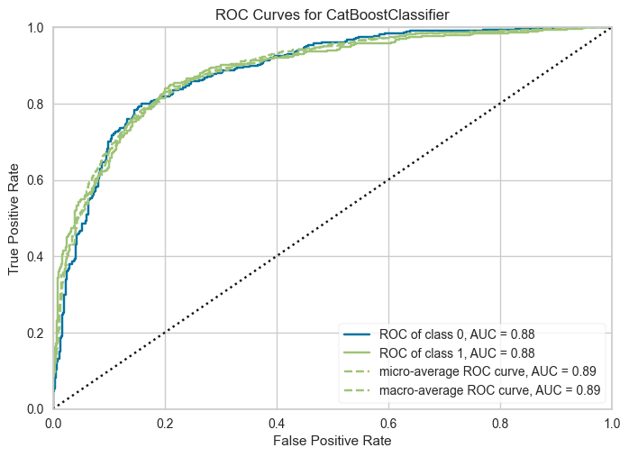
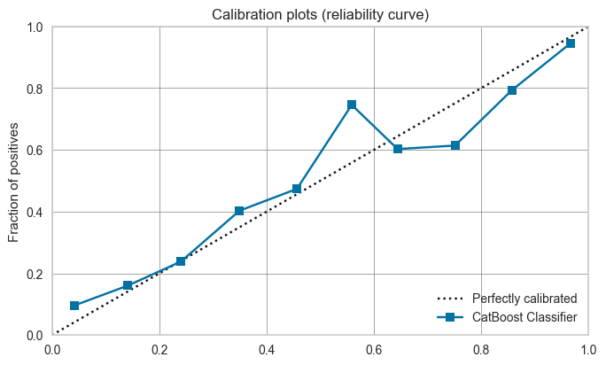
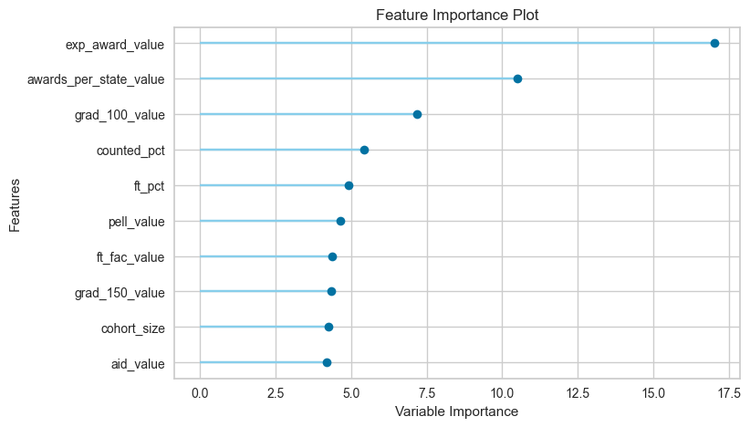

# A Model for Classifying Colleges/Universities Based on Awards Issued

When choosing a higher education institution to attend in the United States, prospective students take into account many aspects such as the availability of financial aid, institutional governance (public vs. private), and/or degree options. For individuals who may not be well-informed about what is available, this could be a confusing encounter. With a high degree of accuracy, this classification model seeks to classify these institutions based on nuber of awards given for every 100 full-time enrolled students, assisting prospective students and their families in making well-informed decisions.

## 1. Data Source

The dataset used was originally authored by [Jonathan Ortiz](https://data.world/databeats). The dataset contains 63 columns and 3797 rows. The features describe demographic information of US colleges and universities including the name, location, 2- or 4-year, SAT scores, awards, expenses per award, financial aid, public or private, etc. Each row contains information about a specific institution. The authors obtained the data from the [National Center for Educational Statistics](https://nces.ed.gov/), [Integrated Postsecondary Education System](https://nces.ed.gov/ipeds/) and the Voluntary System of Accountability’s Student Success and Progress Rate. The dataset can be accessied through the link below:

> * [Kaggle Dataset](https://www.kaggle.com/datasets/thedevastator/boost-student-success-with-college-completion-da/data?select=cc_institution_details.csv)

## 2. Data Wrangling

[Data Wrangling Notebook](HigherEd_Awards_Capstone_Project/HigherEd_Awards_Data_Wrangling.ipynb) 

## 3. Exploratory Data Analysis
[EDA Notebook](HigherEd_Awards_Capstone_Project/HigherEd_Awards_EDA.ipynb)

## 4. Data Pre-processing
[Preprocessing Notebook](HigherEd_Awards_Capstone_Project/HigherED_Awards_Preprocessing.ipynb) 

## 5. Modelling and Tuning
[Model Training/Testing Notebook](HigherEd_Awards_Capstone_Project/HigherED_Awards_ClassificationModels.ipynb) 

The findings reported were obtained after using [PyCaret](https://pycaret.org/) library to train and test the dataset. [PyCaret](https://pycaret.org/) provides an easy way to compare multiple machine learning models across various metrics and selects the best model with low amount of coding.

> *5.1. Performance of Models:*

   

  The best best model was CatBoost, with the following results after hyperparameter tuning:

  
	
> *5.2. ROC Curve of the CatBoostClassifier:*

  
  
> *5.3. Reliability Curve:*

  

> *5.4. Important Features:*

  

## 6. Conclusion
Based on the result of the best performing model,
 * We can classify higher education institutions that have a high number of awards with an accuracy of 83%.
 * We can classify institutions that have a low number of awards issued with 79% accuracy.

Although the model falls short of the intended target of at least 90% accuracy, the [CatBoostClassifier](https://catboost.ai/en/docs/concepts/python-reference_catboostclassifier) is an effective model in classifying higher education institutions based on the number of awards issued for every 100 full-time undergraduate students.
## 7. Further Recommendations
> * Explore additional hyperparameters and maybe ensemble methods to improve the accuracy of the model.

> [!NOTE]
**Acknowledgements:**
I acknowledge my mentor @AmirParizi for guiding me through this Springboard Bootcamp process. I greatly appreciated it. Also, I acknowledge the instructional Faculty at @Datacamp.  
