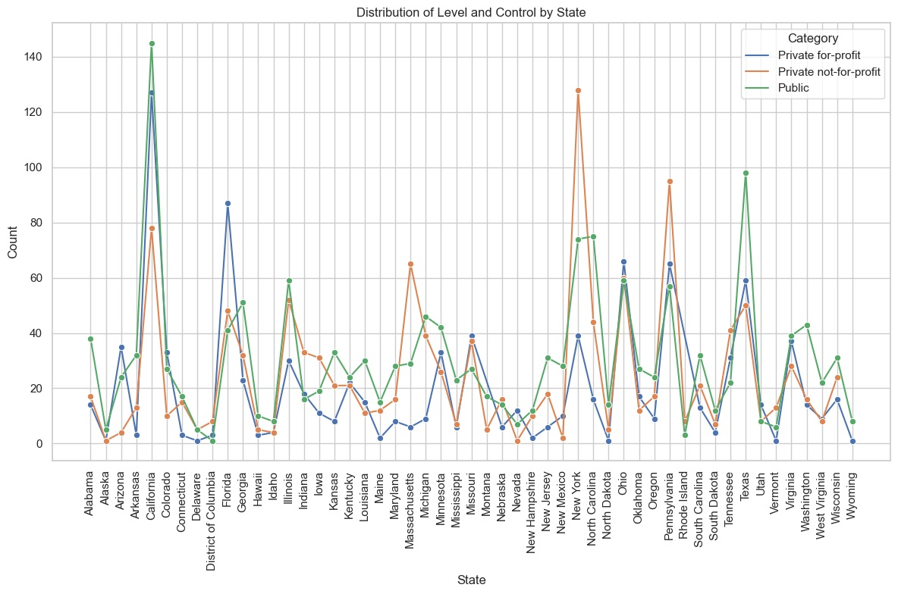
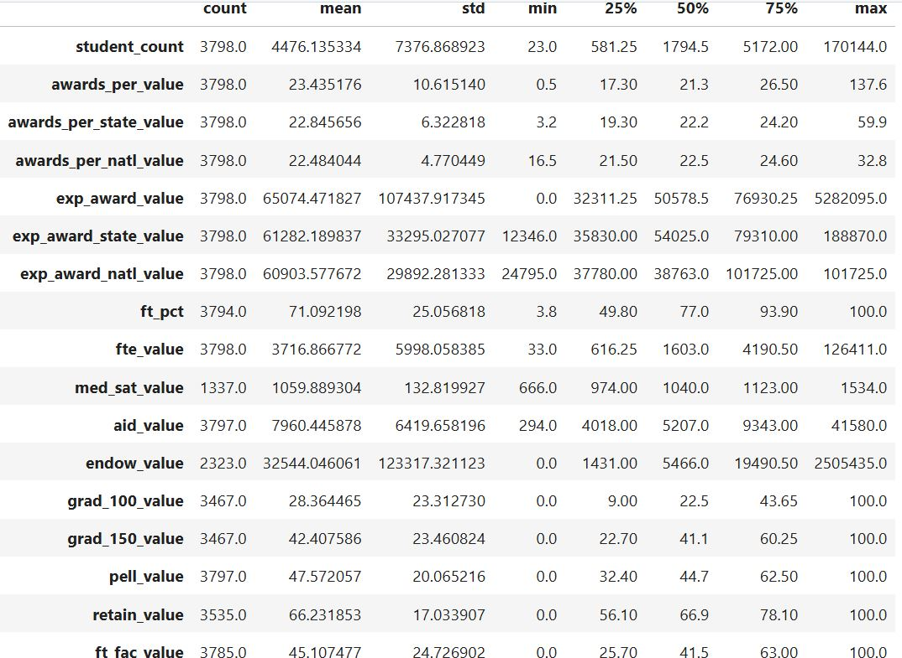

# A Model for Classifying Colleges/Universities Based on Awards Issued

When choosing a higher education institution to attend in the United States, prospective students take into account many aspects such as the availability of financial aid, institutional governance (public vs. private), and/or degree options. For individuals who may not be well-informed about what is available, this could be a confusing encounter. With a high degree of accuracy, this classification model seeks to classify these institutions based on nuber of awards given for every 100 full-time enrolled students, assisting prospective students and their families in making well-informed decisions.

## 1. Data Source

The dataset used was originally authored by [Jonathan Ortiz](https://data.world/databeats). The dataset contains 63 columns and 3797 rows. The features describe demographic information of US colleges and universities including the name, location, 2- or 4-year, SAT scores, awards, expenses per award, financial aid, public or private, etc. Each row contains information about a specific institution. The authors obtained the data from the [National Center for Educational Statistics](https://nces.ed.gov/), [Integrated Postsecondary Education System](https://nces.ed.gov/ipeds/) and the Voluntary System of Accountability’s Student Success and Progress Rate. The dataset can be accessied through the link below:

> * [Kaggle Dataset](https://www.kaggle.com/datasets/thedevastator/boost-student-success-with-college-completion-da/data?select=cc_institution_details.csv)

## 2. Data Wrangling

[Data Wrangling Notebook](HigherEd_Awards_Capstone_Project/HigherEd_Awards_Data_Wrangling.ipynb) 
-	**Duplicate Entries:** No duplicate entries were found in the dataset.
-	**Missing Data:** Columns with more than 90% missing values were dropped. The missing values in ‘flagship’ and ‘hbcu’ columns were filled with ‘no’ to indicate that the institution was not a flagship or not a HBCU. Numeric columns with missing values were imputed with the mean.
-	**Outliers:** Outliers were removed based on the Interquartile Range (IQR) method.
-	**Encoding:** Non-numeric variables including 'level', 'control', 'basic', 'hbcu', and 'flagship' were encoded using [OneHotEncoder](https://scikit-learn.org/stable/modules/generated/sklearn.preprocessing.OneHotEncoder.html).
-	The resulting datset contained 3798 records and 40 variables.

## 3. Exploratory Data Analysis
[EDA Notebook](HigherEd_Awards_Capstone_Project/HigherEd_Awards_EDA.ipynb)
- Distribution of institutions per State was as shown in the following plot:
  
- There were more 4-year institutions compared to 2-year institutions.
- Forty-percent of the institutions were identified as Public institutions.
- Descriptive statistics are displayed below:
  
- The above statistics represent the raw data including possible outliers.
## 4. Data Pre-processing
[Preprocessing Notebook](HigherEd_Awards_Capstone_Project/HigherED_Awards_Preprocessing.ipynb) 
- **Data tranformation:** A new column, 'num_awards_given', was created by binning the target variable 'awards_per_value' into two classes: 'Low' (0-20) and 'High' (21-40). The original 'awards_per_value' column was dropped.
- **Train/Test Split:** Dataset was split into 80% train set and 20% test set. Data were scaled using the StandardScaler() method.
## 5. Modelling and Tuning
[Model Training/Testing Notebook](HigherEd_Awards_Capstone_Project/HigherED_Awards_ClassificationModels.ipynb) 

The findings reported were obtained after using [PyCaret](https://pycaret.org/) library to train and test the dataset. [PyCaret](https://pycaret.org/) provides an easy way to compare multiple machine learning models across various metrics and selects the best model with low amount of coding. See results in the following subsections:

> ***5.1. Performance of Models:***

   

  - The best performing model was CatBoostClassifier, with the following results after hyperparameter tuning:

  

 - CatBoostClassifier is very expensive compared to the other models.

> ***5.2. ROC Curve of the CatBoostClassifier:***

  
- The CatBoostClassifier model performs significantly better than random guessing.
- The micro-average ROC curve reflects the model’s overall performance across all classes and samples. With AUC = 0.89, the model is slightly better performing when considering the overall dataset. While the macro-average AUC suggests a balanced performance across both classes without being skewed by class imbalance.

> ***5.3. Reliability Curve:***

  
- The model is well calibrated, especially in the extreme ends (low and high probabilities). There are some discrepancies in the mid-range probabilities where the model under/overestimates the likelihood of positive outcomes.
- Though the model’s probability predictions are mostly reliable, there are areas where calibration could be improved.

> ***5.4. Important Features:***

  
> The feature importance plot clearly indicates that financial metrics (such as exp_award_value, awards_per_state_value, and aid_value) and student success indicators (like grad_100_value and grad_150_value) are paramount in predicting the number of awards issued per 100 full-time undergraduate students. The contributions from faculty and the structure of student enrollment (ft_fac_value, ft_pct and cohort_size) also play significant roles, providing a comprehensive view of the factors influencing award distribution in higher education institutions.

## 6. Conclusion
Based on the result of the best performing model,
 * We can classify higher education institutions that have a high number of awards with an accuracy of 83%.
 * We can classify institutions that have a low number of awards issued with 79% accuracy.

Although the model falls short of the intended target of at least 90% accuracy, the [CatBoostClassifier](https://catboost.ai/en/docs/concepts/python-reference_catboostclassifier) is an effective model in classifying higher education institutions based on the number of awards issued for every 100 full-time undergraduate students.

- Read more in this [slide deck](HigherEd_Awards_Capstone_Project/HigherEd_Awards_TheDataStory).

## 7. Web App Development with Streamlit

The trained model was used to developed a Web Application using [Streamlit](https://streamlit.io/) and GitHub Codespaces. See code [here](https://github.com/PM696/SpringboardBootCamp_DataScience/blob/main/HigherEd_Awards_Capstone_Project/HigherEd_Awards_Streamlit_App%20Development) .

## 8. Further Recommendations
> * Explore additional hyperparameters and maybe ensemble methods to improve the accuracy of the model.

> [!NOTE]
**Acknowledgements:**
I acknowledge my mentor [@AmirParizi](https://www.linkedin.com/in/amir-parizi-29b532174/) for guiding me through this [Springboard](https://www.springboard.com/landing/home-choices/) Bootcamp process. I greatly appreciated it. Also, I acknowledge the instructional Faculty at [@Datacamp](https://www.datacamp.com/).  
